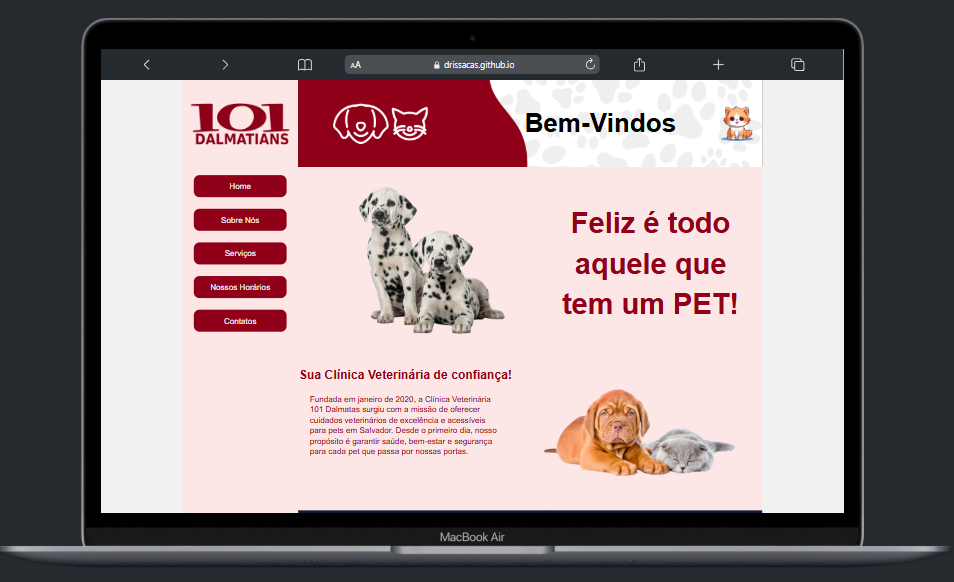
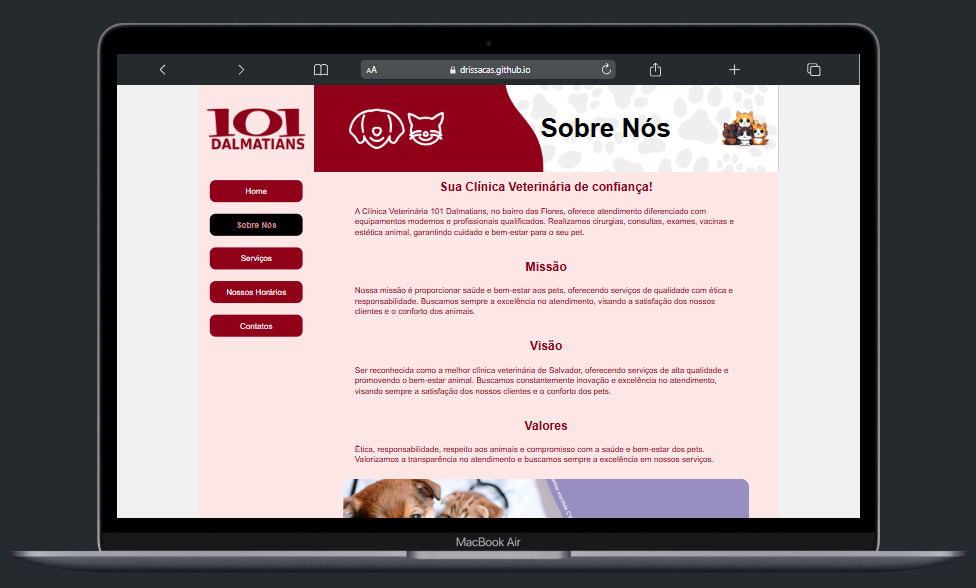
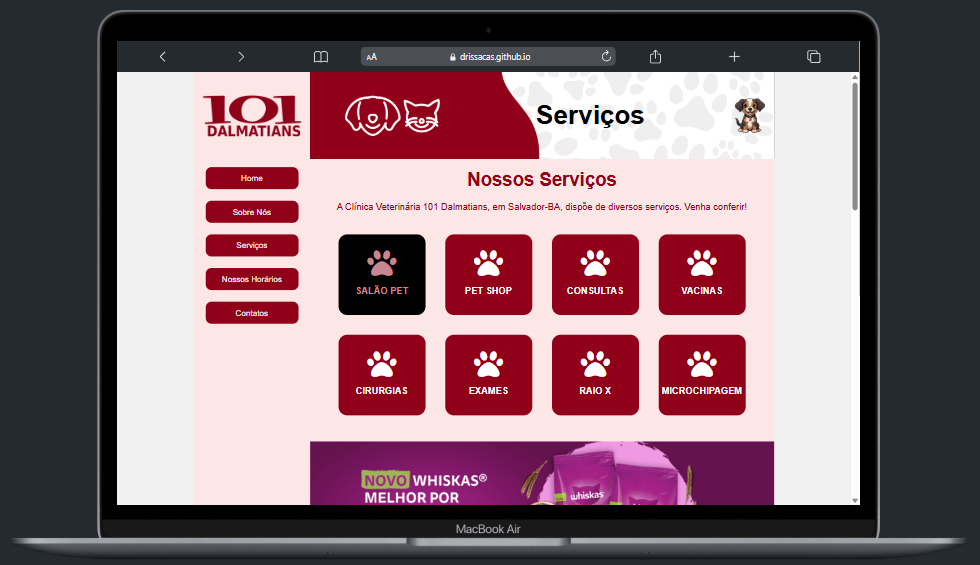
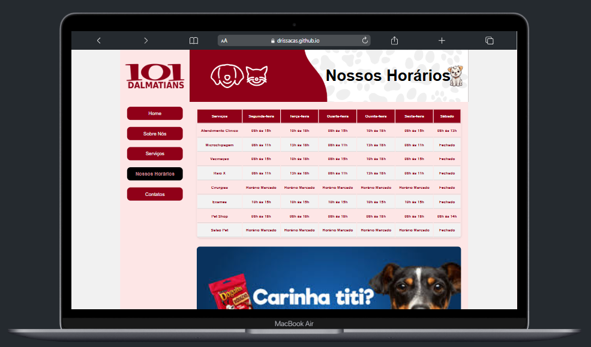
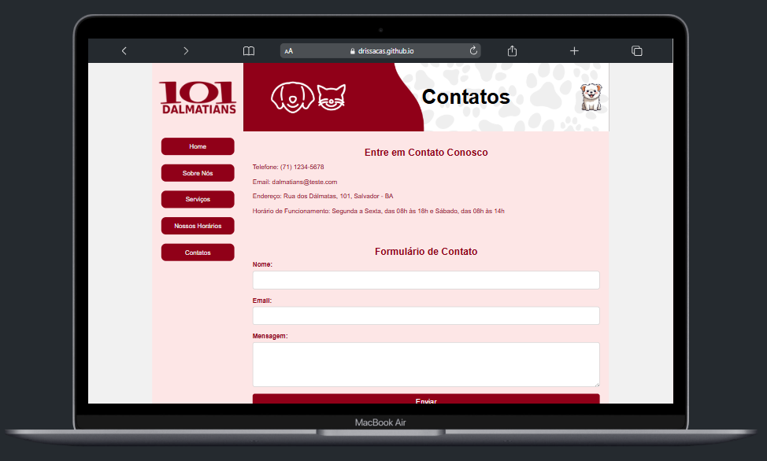

# 🏥 Clínica Veterinária – Desafio DIO  

Este projeto foi desenvolvido como parte da trilha da **Formação HTML Web Developer** da DIO, com o objetivo de praticar **HTML semântico, formulários, tabelas e estruturação de páginas**.  

## 📌 Sobre o desafio  
O desafio proposto pela DIO consistia em criar um site fictício de uma clínica médica, contendo:  
- **Página Principal** (com imagem e descrição da clínica)  
- **Sobre a Clínica** (informações institucionais)  
- **Horário de Atendimento** (tabela de serviços)  
- **Contato** (formulário + dados de contato)  

🔗 [Veja mais sobre a DIO](https://github.com/digitalinnovationone/trilha-html-modulo-2)  

---

## 🚀 Tecnologias utilizadas  
- **HTML5** – Estruturação e semântica  
- **CSS3** – Estilização e Flexbox  
- **Font Awesome** – Ícones de redes sociais  

---

## 📄 Estrutura do projeto  
O site é composto por **5 páginas**:  

- 🏠 **Home** – Apresentação da clínica com imagens e texto.  
- ℹ️ **Sobre Nós** – Detalhes sobre a clínica fictícia.  
- 🕒 **Horários** – Tabela de serviços e horários de atendimento.  
- 📞 **Contatos** – Formulário com campos obrigatórios e informações de contato.  
- 💼 **Serviços** (extra) – Página adicional criada para listar os serviços principais, com cards interativos usando Flexbox.  

---

## 🎯 Aprendizados  
Durante o desenvolvimento, pratiquei:  
- Uso de **tags semânticas** para melhor estrutura do código;  
- Criação de **layouts responsivos** com Flexbox;  
- Construção e estilização de **tabelas**;  
- Implementação de **formulários** simples com feedback de envio;  
- Integração de **ícones externos** via Font Awesome.  

---

## 📸 Demonstração

### Home  

### Sobre Nós

### Serviços

### Nossos Horários

### Contatos

---

## 🔗 Acesse o projeto
 
Você pode visualizar o projeto online clicando aqui: [**Deploy do projeto**](https://drissacas.github.io/clinica-demo/)

---

👨‍💻 Desenvolvido como parte da trilha da **Formação HTML Web Developer – DIO.me**.  